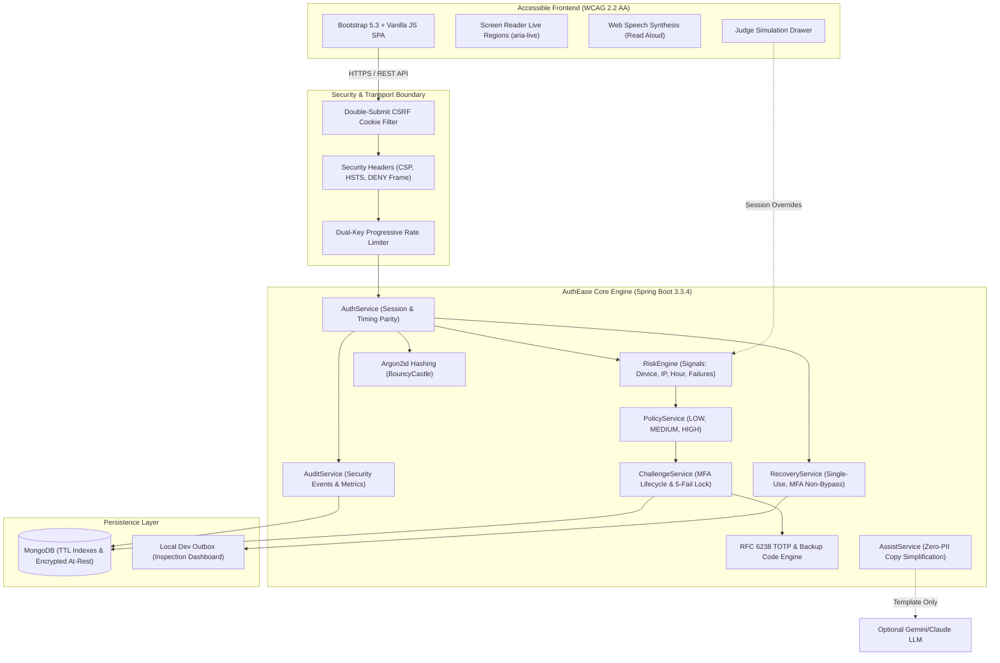

# AuthEase - Adaptive, Secure & Accessible Digital Authentication

[](https://www.oracle.com/java/)
[](https://spring.io/projects/spring-boot)
[](https://www.mongodb.com/)
[](https://www.w3.org/WAI/standards-guidelines/wcag/)
[](LICENSE)

> **Hackathon Challenge:** *Secure & Accessible Digital Authentication*  
> **Core Mission:** Strong security that is understandable, accessible, and recoverable.

AuthEase replaces hostile authentication friction (captchas, impossible password rules, confusing error codes) with **context-adaptive risk scoring**, **Grade 6–8 plain language explanations**, **live Web Speech synthesis**, and **robust multi-layered defenses** (Argon2id, NIST SP 800-63B, rate delay curves, single-use tokens, and defense-in-depth admin gates).

---

## Architecture Diagram



---

## Tech Stack & Specifications

| Component | Technology | Rationale |
| :--- | :--- | :--- |
| **Backend Framework** | Java 17, Spring Boot 3.3.4 | Robust enterprise-grade reactive and MVC foundation. |
| **Security Framework** | Spring Security 6.3.3 | Fine-grained request mapping, CSRF filtering, session management. |
| **Password Hashing** | Argon2id via BouncyCastle (`bcprov-jdk18on`) | Memory-hard defense ($m=19456, t=2, p=1$) against GPU/ASIC attacks. |
| **Multi-Factor Auth** | SAM Stevens TOTP (`dev.samstevens.totp`) | RFC 6238 standard TOTP with time-step replay defense. |
| **Database** | Spring Data MongoDB | Scalable document storage with automated TTL index expiration. |
| **Accessibility (A11y)**| Vanilla JS, Web Speech API, WCAG 2.2 AA | High contrast, keyboard navigation, live screen reader announcements. |
| **Containerization** | Multi-Stage Dockerfile (Alpine JRE 17) | Capped heap memory (`-Xmx350m`) optimized for free cloud tiers. |

---

## Quick Start (Local Setup)

### Option 1: One-Click Docker Compose (Recommended)

Starts MongoDB 7.0 and the AuthEase application together with healthchecks:

```bash
# Clone the repository
git clone https://github.com/smtharun2007-coder/sns085.git
cd sns085

# Build and start all services
docker compose up --build
```

Access the application:
- **Application Portal:** [http://localhost:8080](http://localhost:8080)
- **Dev Email Outbox:** [http://localhost:8080/dev-outbox.html](http://localhost:8080/dev-outbox.html)
- **Health Endpoint:** [http://localhost:8080/api/health](http://localhost:8080/api/health)

---

### Option 2: Bare-Metal Local Development

Ensure **Java 17** is installed on your PATH and MongoDB is running locally on port 27017:

```bash
# Windows
mvnw.cmd test
mvnw.cmd spring-boot:run

# Linux / macOS
./mvnw test
./mvnw spring-boot:run
```

---

## Configuration & Environment Variables

| Variable | Default Value | Description |
| :--- | :--- | :--- |
| `SPRING_DATA_MONGODB_URI` | `mongodb://localhost:27017/authease` | MongoDB connection URI. Supports MongoDB Atlas strings. |
| `SERVER_PORT` | `8080` | HTTP port for the web service. |
| `APP_BASE_URL` | `http://localhost:8080` | Base URL used for generated verification and password reset links. |
| `AUTHEASE_DEMO_MODE` | `true` | Enables interactive judge simulation toggles in `/api/demo/**`. |
| `AUTHEASE_ENC_KEY` | `0123456789abcdef0123456789abcdef` | 32-character AES-256 key for encrypting TOTP secrets at rest. |
| `AUTHEASE_AI_API_KEY` | *(empty)* | Optional Gemini/OpenAI API key for plain-English rephrasing. |
| `JAVA_TOOL_OPTIONS` | `-Xmx350m -Xms128m` | Memory constraints suited for Render/Railway free tiers. |

---

## Cloud Deployment Guide

### 1. MongoDB Atlas (Free M0 Cluster)
1. Create a free account at [mongodb.com/atlas](https://www.mongodb.com/atlas).
2. Deploy a free **M0 Sandbox** cluster.
3. In **Network Access**, add `0.0.0.0/0` (allow access from anywhere) or your cloud host IP.
4. In **Database Access**, create a user and password.
5. Copy your connection string:
   `mongodb+srv://<username>:<password>@cluster0.abcde.mongodb.net/authease?retryWrites=true&w=majority`

### 2. Render.com
1. Create a **New Web Service** connected to your repository.
2. Select **Docker** environment.
3. Under **Environment Variables**, set:
   - `SPRING_DATA_MONGODB_URI`: *Your MongoDB Atlas connection URI*
   - `AUTHEASE_DEMO_MODE`: `true`
   - `AUTHEASE_ENC_KEY`: `0123456789abcdef0123456789abcdef`
   - `JAVA_TOOL_OPTIONS`: `-Xmx350m -Xms128m`
4. Deploy!

### 3. Railway.app
1. Create a **New Project** and select **Deploy from GitHub repo**.
2. Add a **MongoDB** service or provide your Atlas URI.
3. Under service variables, add the environment variables listed above.
4. Railway will automatically build using the included `Dockerfile` and expose port 8080.

---

## Running Automated Tests

Run the full automated test suite (including all 85 unit and integration tests):

```bash
# Windows
mvnw.cmd test

# Linux / macOS
./mvnw test
```

Verified test coverage includes:
- ✅ NIST SP 800-63B password complexity and HaveIBeenPwned blacklist check
- ✅ Single-use password recovery tokens with session invalidation
- ✅ Constant-time Argon2 dummy hash execution (<50ms timing disparity)
- ✅ Progressive exponential rate limit delay curves ($1s \to 60s$)
- ✅ Emergency backup code single-use consumption
- ✅ Defense-in-depth admin portal protection requiring active TOTP MFA (`ADMIN_MFA_REQUIRED`)
- ✅ Double-submit CSRF cookie token enforcement on state-modifying requests
- ✅ Challenge locking and destruction after 5 failed code attempts
- ✅ Email approval link execution restricted to `POST` requests (`405 Method Not Allowed` for `GET`)

---

## Hackathon Judge Walkthrough

A comprehensive evaluation script covering every rubric requirement with UI instructions and `curl` commands is documented in:
👉 **[DEMO-SCRIPT.md](file:///c:/xampp/htdocs/sns/sns085/DEMO-SCRIPT.md)**

Full threat modeling and security mitigations are detailed in:
👉 **[SECURITY.md](file:///c:/xampp/htdocs/sns/sns085/SECURITY.md)**
